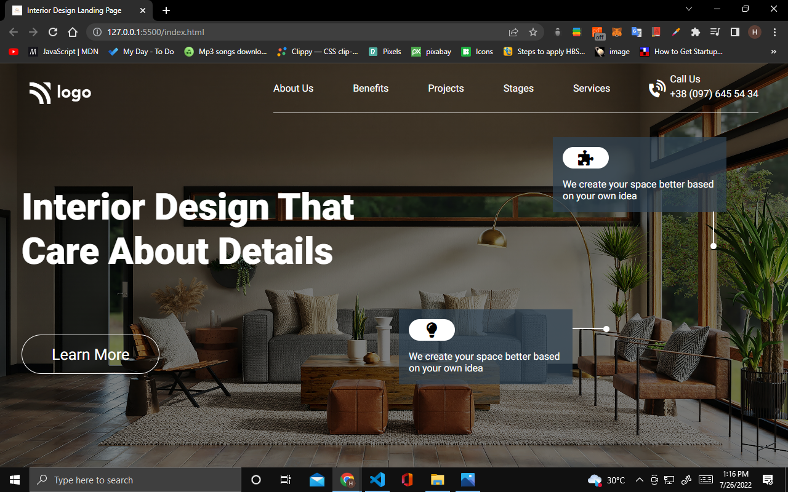
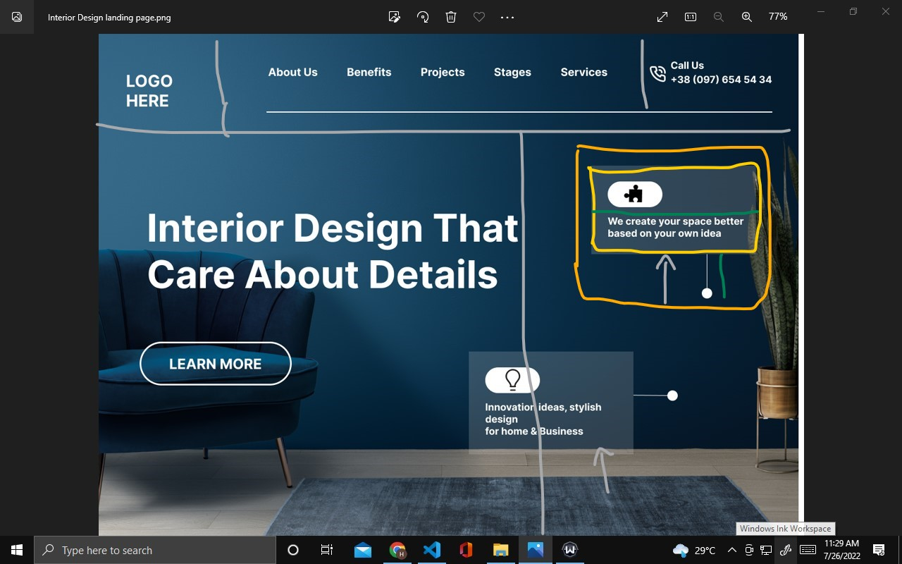

# Project 10 Interior Design Landing Page

## Hey there, I am Hitesh Pal

I have build this website with my core HTML CSS skills.

You can check out here: [Interior Design By Hitesh](https://justice-by-hitesh.netlify.app/)

## What i have learned from this project

    - In this project I have learned how to use HTML and css to build templates.
    - How to use position absolute and relative and how they works in DOM.
    - I also explored and apply background url images in a div element.

## My Approach

## This project took me around 2:30 hours approximately.

### Connect with me 
[Twitter](https://twitter.com/HiteshP25522550) 
[Linkdin](https://www.linkedin.com/in/hitesh-pal-8379011ab/)
